# Amyloidogenic Mutagenesis and Structural Dynamics of Aβ39

Author: Sergey Ilin
Date: 28.05.2026

This repository contains the complete computational workflow for Aβ39 for the study *“Prediction and prioritisation of mutations influencing on amyloidogenic properties of Aβ and PrP”*.

The pipeline comprises systematic mutagenesis of Aβ39, consensus‑based aggregation propensity prediction, and all‑atom molecular dynamics simulations of wild‑type and selected mutant structures (monomers and tetramers).

## Repository Structure

- `Mutagenesis_and_Predictions/` – scripts for mutant generation and aggregation propensity assessment  
- `MD/` – GROMACS protocols and automation for molecular dynamics simulations  
- `results/` – processed trajectories and Jupyter notebooks for data analysis  
- `images/` – final figures  
- `gifs/` – molecular dynamics trajectory animations  
- `requirements.txt` – Python dependencies  

## 1. Environment Setup

**System requirements:** GROMACS 2024.3 compiled with CUDA 12.8 support (GPU acceleration required), Python ≥3.10, CUDA Toolkit 12.8.

**Installation:**  
Clone the repository with `git clone https://github.com/emnshchkv/Amyloidogenic-Mutagenesis.git`, enter the directory `cd Amyloidogenic-Mutagenesis`, and switch to the branch `git checkout amyloid-beta-39-analysis`.  

Create a virtual environment: `python -m venv venv`. Activate it with `source venv/bin/activate` (Linux/macOS) or `venv\Scripts\activate` (Windows).  

Install the required Python packages: `pip install -r requirements.txt`.  

Ensure that the `gmx` executable is available in your `$PATH`.

## 2. Mutant Generation and Aggregation Prediction

Navigate to the prediction directory: `cd Mutagenesis_and_Predictions/scripts`. Execute the following scripts sequentially:  

- `python make_mutants.py` – generates all single‑point mutants in amyloidogenic regions of Aβ39.  
- `python Aggregation_ranking.py` – runs the consensus aggregation propensity predictor.  

This workflow produces mutant structures and ranks them according to predicted changes in amyloidogenicity using a consensus of established algorithms (TANGO, PASTA 2.0, AmyPred, and CrossBeta).

## 3. Molecular Dynamics Simulations

All MD protocols are automated via GNU Make within the `MD/` directory.

**Example for the wild‑type monomer:**  
`cd MD/MD_monomers/WT`  
`make -j2 all` – full pipeline (setup + production MD).  

Alternatively, step‑by‑step:  
`make setup` – topology, solvation, energy minimization, equilibration.  
`make run_md` – production MD run.  
`make process` – trajectory processing.  
`make protein_only` – generate a protein‑only trajectory (no solvent).  

Repeat the procedure for selected mutant in both monomeric and tetrameric systems located in `MD/MD_monomers/` and `MD/MD_tetramers/`. Detailed protocols are provided in the respective `README.md` files and the `Makefile` in each subdirectory.

## 4. Results Analysis

Processed trajectories are available in `results/XTCs_and_TPRs/NO_SOL/`.  

Launch the analysis notebooks: `cd results/notebooks` and `jupyter lab`.  

**Key notebooks:**  
- `Monomers_analysis.ipynb` – analysis of monomeric systems (RMSD, RMSF, Rg, SASA).  
- `Tetramers_analysis.ipynb` – analysis of tetrameric assemblies (inter‑chain contacts, oligomer stability).  

These notebooks reproduce all figures presented in the study.

**Visualisation materials:**  
- `images/` – high‑resolution figures for publication.  
- `gifs/` – animated trajectories demonstrating structural dynamics.

## Reproducibility Pipeline Summary

1. Set up the computational environment as described above.  
2. Generate mutants and compute aggregation predictions.  
3. Perform molecular dynamics simulations for selected systems.  
4. Process trajectories using the provided `Makefile` targets.  
5. Execute the analysis notebooks in `results/notebooks/`.  

All simulation parameters and analysis scripts are included to ensure full reproducibility.

# Main Results and Discussion

## Consensus ranking

Consensus z-score (mean across four tools: TANGO, PASTA, AmyPred-FRL, Cross-beta) for all 399 variants. Bars above zero indicate predicted increase in aggregation; bars below zero indicate predicted decrease. Top-10 aggregators and top-10 disruptors are highlighted with a gold outline.

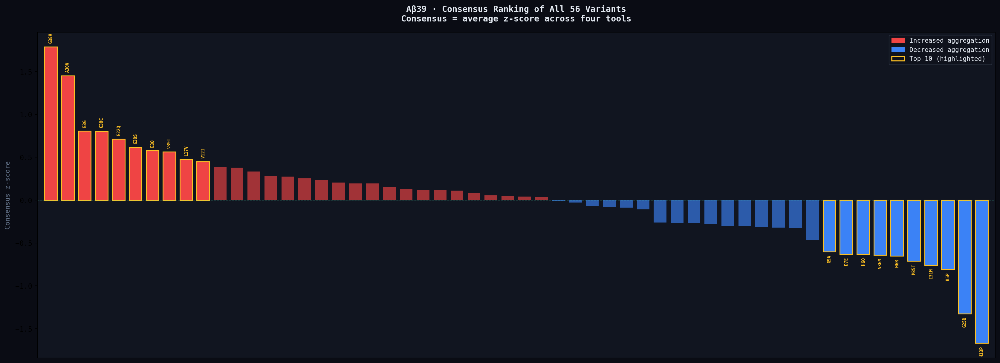

G25D were selected for further analysis.

## Molecular dynamics analysis

We first recommend viewing the animation generated in PyMOL, available at `gifs/Tetramers_WT_vs_G25D.gif`. In this visualization, the wild‑type protein is shown in magenta, while the G25D mutant is shown in cyan. It is readily apparent that the tertiary structure of the mutant becomes less stable compared to that of the wild‑type protein.

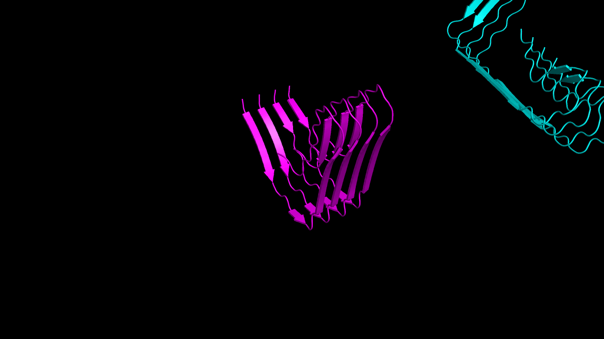

It is confirmed by the molecular dynamics data analysis in `results/notebooks/Tetramers_analysis.ipynb` The mutant G25D protein spends 20% in a disaggregated state, while the wild type spent the entire simulation in the mid-tetramer state.

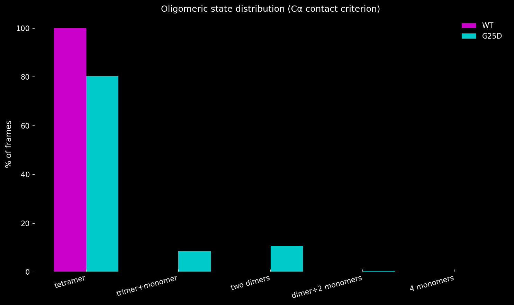

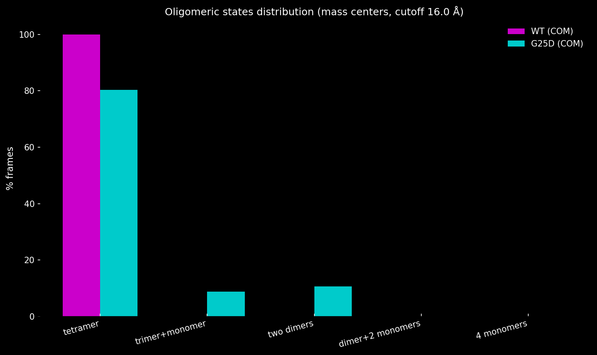

Destabilization of the contact between monomers is also visible in the heat map of interactions and the distribution of contacts between different regions. The mutation clearly reduces the density of monomer contacts in the turn zone.

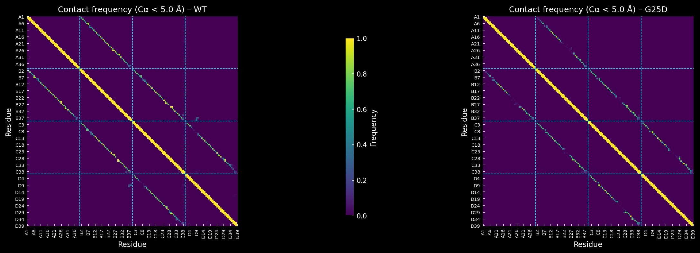

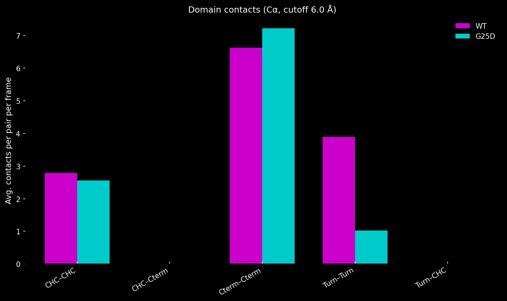

Moreover, the model shows that significantly fewer hydrogen bonds are formed between the monomers in the mutant (42 versus 50 in the tetramer), and the D23-K28 salt bridge, which is essential for the formation of the amyloid structure, is practically not formed in the mutant compared to the wild type.

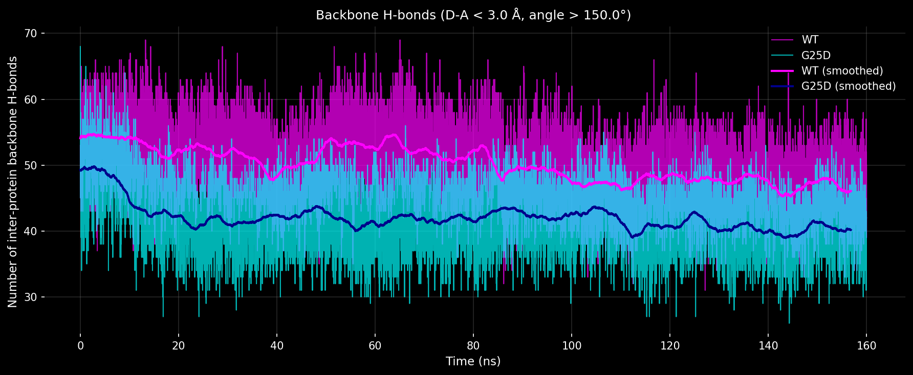

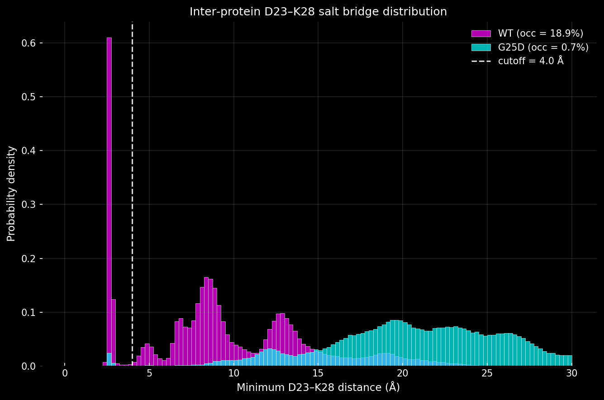

We hypothesized that by replacing glycine at position 25 with aspartate, we disrupted the flexibility of the protein chain at the turning zone, leading to destabilization of the native secondary structure of the monomers. This can be observed dynamically. We invite you to view the molecular dynamics animations of the monomers `gifs/Monomer_WT.gif` and `gids/Monomer_G25D.gif`. The 25th amino acid residue, which was mutated, is highlighted in red. The wild-type protein is visible after approximately 80-90 ns. In the model, the protein bends along this residue and folds into a stable structure, while the mutant protein failed to fold in this manner during the simulation. However, this may simply be due to the short simulation time and the small number of dynamics replicates. This fact can be clearly demonstrated by the Radius of Gyration dynamics of the monomers and the heat map of intramolecular contacts.

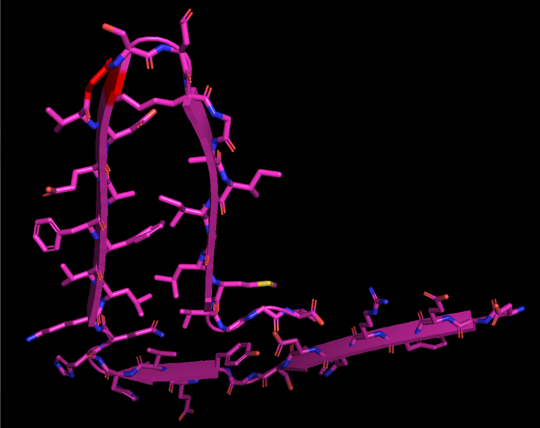

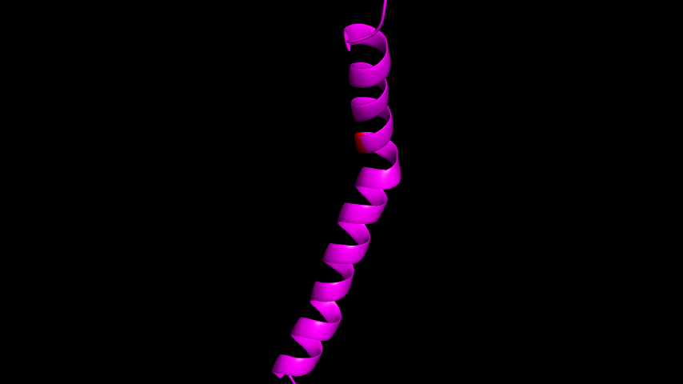

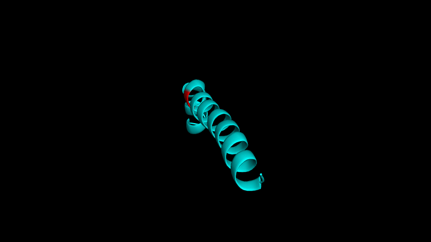

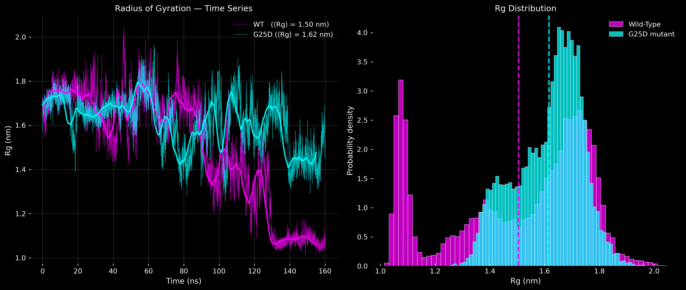

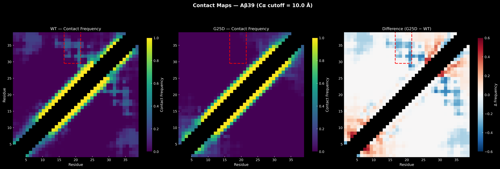

## Reference

Bioinformatics Institute, 2026.
