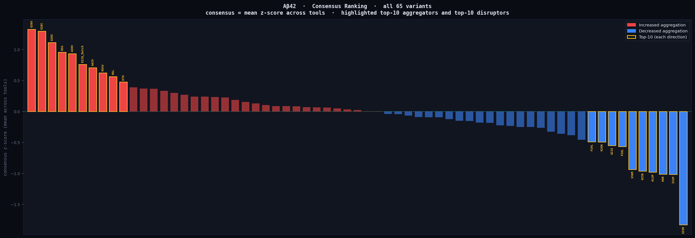
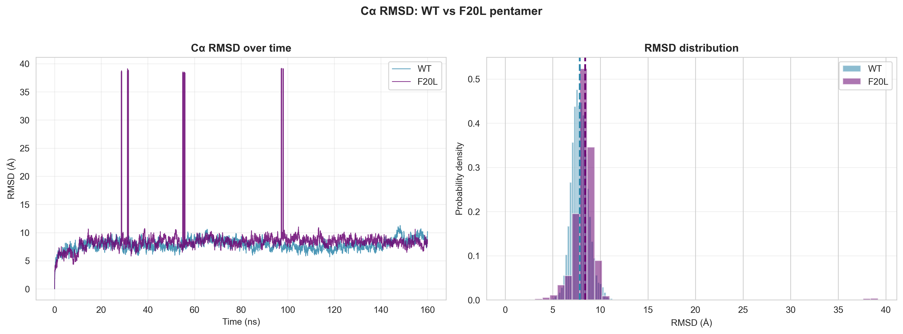
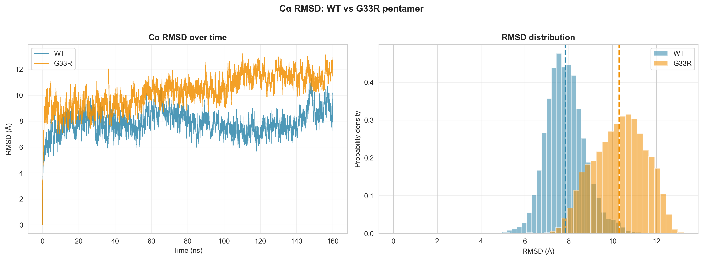
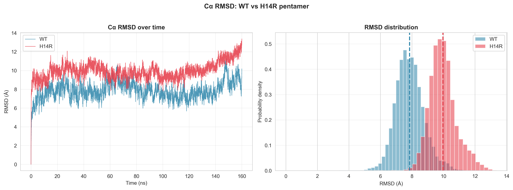
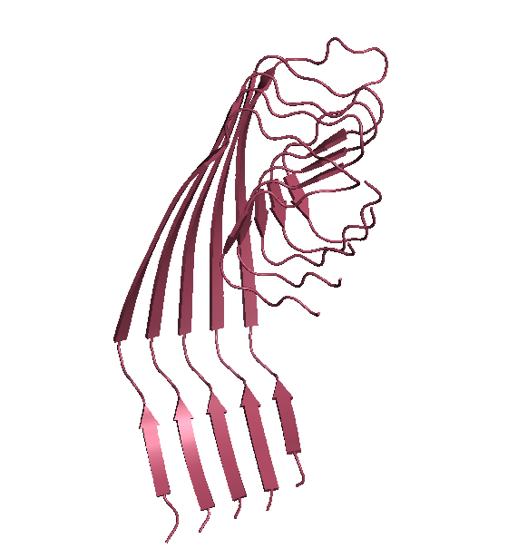
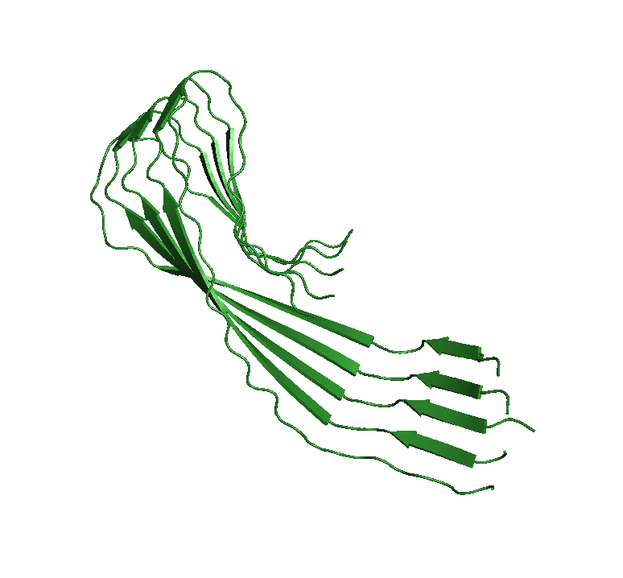
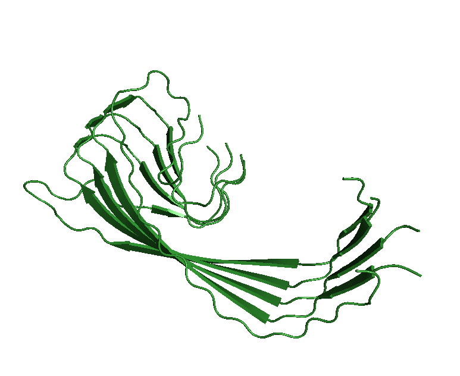
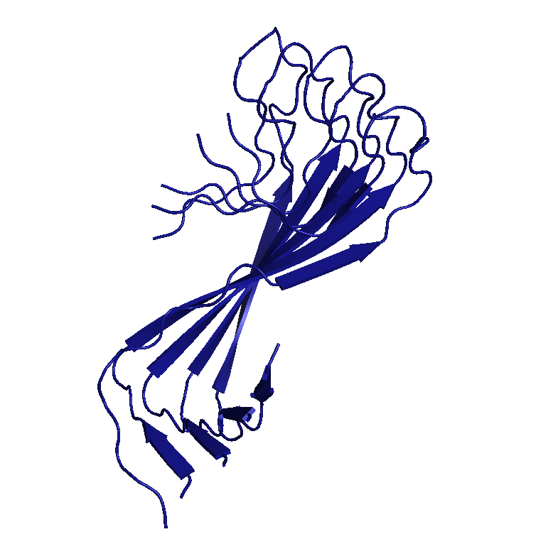
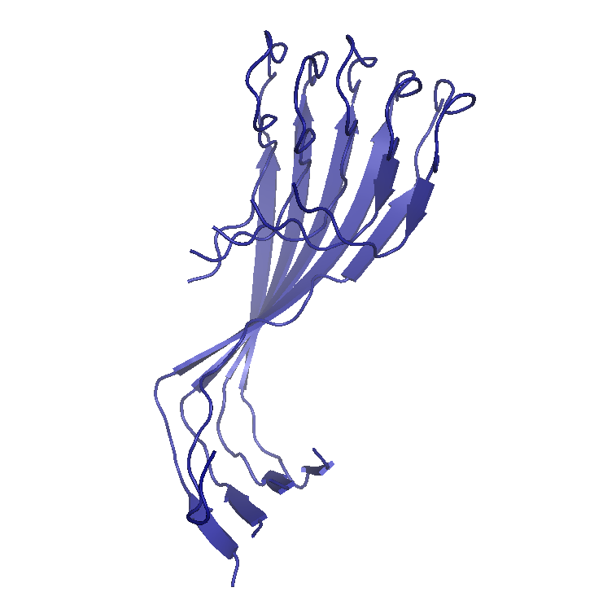

Repository for the prediction and prioritization of mutations that influence the amyloidogenic properties of Aβ and PrP. Project conducted at the Bioinformatics Institute, 2026.

# Aβ42 Mutant Pentamer MD Study

Computational study of Aβ42 (amyloid-beta 42) point mutations using amyloidogenicity prediction tools and all-atom molecular dynamics simulations of pentameric assemblies. Three mutations — **F20L**, **G33R**, and **H14R** — were selected based on consensus ranking across six predictors and simulated for ~160 ns each to characterise their structural effects relative to the wild-type.

---

## Pipeline Overview

```
Six predictors                       GROMACS MD (160 ns)
(TANGO, PASTA, WALTZ,          →    WT + 3 selected mutants    →    Trajectory analysis
 Cross-beta, AmyPred, AmyloGram)          pentamers                  & WT comparison
          ↓
  Consensus ranking
→ select top disruptors
    for simulation
```

### Step 0 — In Silico Amyloid Mutagenesis

Complete library of Aβ42 single-point substitution variants were generated that serve as input for all downstream prediction tools (Step 1) and selects the mutation targets for MD simulation (Steps 2–3).

→ Full documentation: [`0_step_mutagenesis/`](0_step_mutagenesis/)

### Step 1 — Amyloidogenicity Prediction

Sixty-five Aβ42 point-substitution variants were submitted to six prediction tools. Each tool computes a different proxy for aggregation propensity (total aggregation score, best amyloid energy, per-residue cross-beta propensity, amyloid probability, or regional amyloid segments). Tool outputs were normalised and combined into a **consensus z-score ranking** to identify mutations that most robustly decrease or increase aggregation across tools.

→ Full documentation: [`1_step_prediction_tools_analysis/`](1_step_prediction_tools_analysis/)

### Step 2 — MD Simulations

Wild-type Aβ42 and the three selected mutants (F20L, G33R, H14R) were built as pentameric β-sheet assemblies using AlphaFold3. Each system was energy-minimised, equilibrated, and simulated for ~160 ns in explicit solvent with the CHARMM36m force field in GROMACS.

→ Full documentation: [`2_step_md_run/`](2_step_md_run/)

### Step 3 — Trajectory Analysis

Two notebooks process each trajectory: one characterises the mutant in isolation (RMSD, RMSF, Rg, DSSP, H-bonds, PCA, Ramachandran, convergence) and one performs a direct WT vs mutant comparison.

→ Full documentation: [`3_step_md_analysis/`](3_step_md_analysis/)

---

## Results

### Consensus Ranking



Consensus z-score (mean across four tools: TANGO, PASTA, AmyPred-FRL, Cross-beta) for all 65 variants. Bars above zero indicate predicted increase in aggregation; bars below zero indicate predicted decrease. Top-10 aggregators and top-10 disruptors are highlighted with a gold outline. **F20L**, **G33R**, and **H14R** were selected to cover different regions of the sequence and different predicted effect magnitudes.

---

### Cα RMSD: WT vs Mutants

RMSD from the starting structure was computed for Cα atoms across the full ~160 ns trajectory. The distribution panel shows the mean (dashed line) for each system.

#### F20L — neutral structural perturbation



F20L shows an RMSD distribution nearly identical to WT (~7–9 Å), with three sharp transient spikes (at ~28, ~58, and ~98 ns) reaching ~39 Å — artefacts of a single monomer briefly escaping and re-docking during the simulation. The bulk distribution is unaffected, indicating that this mutation does not substantially alter the global stability of the pentamer.

#### G33R — increased structural deviation



G33R shows a consistently elevated RMSD relative to WT throughout the trajectory, with the distribution shifted from ~7–8 Å (WT) to ~10–13 Å (G33R). The broadened distribution and lack of convergence toward a single peak suggest that the arginine substitution at position 33 destabilises the hydrophobic core of the pentamer and introduces ongoing structural rearrangement.

#### H14R — progressive structural drift



H14R displays not only a shifted distribution (~10 Å vs ~7.5 Å for WT) but also a clear upward drift in the RMSD time series after ~140 ns, reaching ~13 Å by the end of the simulation. This progressive drift suggests that the histidine-to-arginine substitution at position 14 introduces a bulky charged residue into a region important for early pentamer organisation, leading to slow but continuous structural remodelling.

---

### Pentamer Structures from Trajectory Snapshots

Representative VMD ribbon renders illustrate the conformational state of each pentamer at key timepoints.

#### F20L — 15 ns



The F20L pentamer at 15 ns retains the characteristic parallel β-sheet arrangement of Aβ42 fibrils, with five strands aligned in register and the N-terminal region forming disordered loops. The overall fold is consistent with a stable fibril-like assembly, in agreement with the RMSD data showing minimal deviation from WT.

#### G33R — 90 ns and 150 ns

| 90 ns | 150 ns |
|:---:|:---:|
|  |  |

At 90 ns, the G33R pentamer shows significant splaying of the C-terminal β-strands — the five monomers begin to lose their parallel register, rotating relative to each other. By 150 ns, the pentamer has adopted a markedly different conformation, with the β-sheet core partially unwound and the C-terminal strands forming a splayed fan-like arrangement. This progressive disorganisation is consistent with the broad, high-RMSD distribution seen in the RMSD analysis.

#### H14R — 130 ns and 150 ns

| 130 ns | 150 ns |
|:---:|:---:|
|  |  |

At 130 ns, the H14R pentamer shows a more compact but twisted arrangement compared to WT, with the β-strands converging into a tighter bundle while the N-terminal loops become more ordered. By 150 ns, the structure has reorganised further — the two β-sheet layers (N-terminal and C-terminal) are shifting relative to each other, and several monomers show partial strand separation. The structural drift visible in these snapshots directly corresponds to the rising RMSD time series seen after ~140 ns.

---

## Summary

| Mutation | Position | Region | Consensus z-score | RMSD vs WT | Structural effect |
|---|---|---|---|---|---|
| F20L | 20 | Central hydrophobic core | moderate disruptor | ≈WT | Minimal; transient monomer escape only |
| G33R | 33 | C-terminal β-strand | strong disruptor | +2–3 Å | Progressive C-terminal splaying; strand register loss |
| H14R | 14 | N-terminal / loop region | strong disruptor | +2–3 Å; drifting | Slow structural remodelling; inter-sheet sliding |

All three mutations were predicted by the consensus ranking to reduce Aβ42 aggregation propensity. MD simulations confirm that G33R and H14R substantially destabilise the pentameric assembly, while F20L produces only minor structural perturbation despite being ranked as a moderate disruptor — consistent with the conservative Phe→Leu substitution preserving hydrophobicity at position 20.