# Prion Protein (PrP) Study

Computational study of PrP (Prion Protein) point mutations using amyloidogenicity prediction tools and all-atom molecular dynamics simulations. A targeted library of 118 mutations within the critical amyloidogenic region (residues 170–195) was generated. The top mutation — **V180R** — was selected based on consensus ranking across five predictors and simulated to characterise its structural effects and stabilizing potential relative to the wild-type (WT).

---

## Pipeline Overview

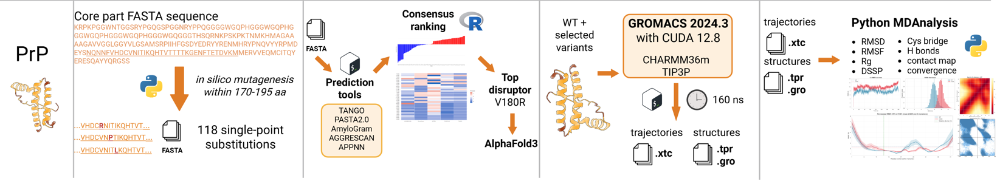

### Step 1 — In Silico Amyloid Mutagenesis
A complete library of 118 single-point substitution variants within the consensus amyloidogenic region (170–195 aa) was generated. The initial wild-type sequences were appropriately trimmed to isolate the structured C-terminal core (residues 23–231), providing the structural basis for all downstream prediction tools (Step 1).

→ Full documentation & scripts: 01_mutagenesis/

### Step 2 — Amyloidogenicity Prediction
All 118 point-substitution variants were submitted to five distinct prediction algorithms. Each tool computes a different proxy for aggregation propensity (e.g., minimum free energy, cross-beta aggregation peak, sequence-based probability). The results were aligned and Z-standardized to produce an Integrative Score. V180R emerged as the strongest predicted amyloid breaker and was selected for molecular dynamics simulations.

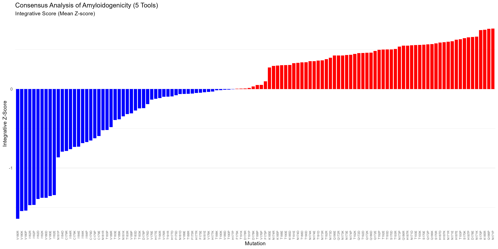

→ Full documentation & scripts: 02_prediction/

### Step 3 — Molecular Dynamics Simulations
All-atom molecular dynamics simulations were performed using GROMACS to evaluate the physical consequences of the mutation. Both the Wild-Type PrP and the V180R mutant were simulated under identical conditions (CHARMM36m force field, TIP3P water, physiological pH and salt concentrations) to ensure comparability.

→ Full documentation & scripts: 03_md_run/

### Step 4 — Trajectory Analysis
The resulting MD trajectories were analyzed to assess structural stability and local dynamics. Using MDAnalysis in Python, two comprehensive Jupyter notebooks were developed (for WT and V180R) to calculate structural observables (RMSD, RMSF, Radius of Gyration), track secondary structure evolution (DSSP), and map intramolecular interactions (hydrogen bond networks, H2-H3 interfaces, and disulfide bridges).

→ Full documentation & notebooks: 04_md_analysis/

## Results and Summary

The comparison between the WT Prion protein and the prioritized **V180R** mutant reveals a clear structural mechanism: the mutation rigidifies and stabilizes the native α-helical fold of the C-terminal domain, thereby acting as a powerful barrier against pathological conformational transitions.

### 1. Equilibrium Dynamics and Core Stability (RMSD)
All-atom molecular dynamics trajectories demonstrate that the V180R mutant achieves significantly higher structural stability compared to the WT.
* The global backbone RMSD of the WT fluctuates around an average of **2.6 Å**, whereas the V180R mutant remains tightly constrained at an average of **1.8 Å**.
* This rigidification effect is consistently observed across all three major α-helices, with the mutant exhibiting markedly reduced deviations from the native fold:

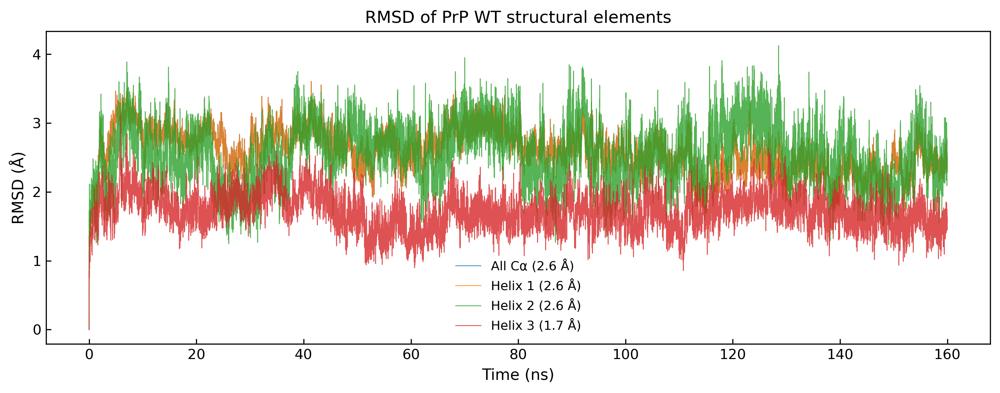

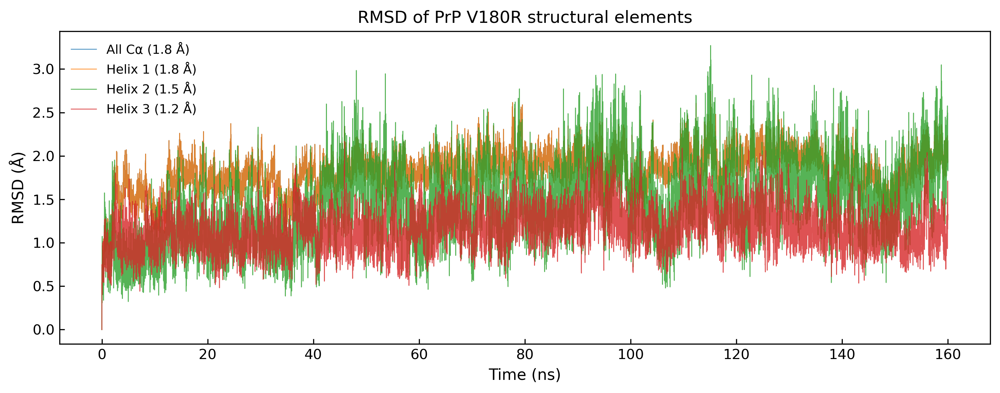

| Structure Element | WT Average RMSD (Å) | V180R Average RMSD (Å) |
|---|---|---|
| **Global Backbone** | 2.6 | 1.8 |
| **Helix 1** | 2.6 | 1.8 |
| **Helix 2** | 2.6 | 1.5 |
| **Helix 3** | 1.7 | 1.2 |

### 2. Compactness and Conformational Space ($R_g$ & $R_g$-$R_{ee}$ Correlation)
The global shape metrics indicate that the V180R mutation induces a more stable, uniformly compact ensemble.
* **Radius of Gyration ($R_g$):** The $R_g$ timeline for V180R is smooth with minimal fluctuations, yielding a normal distribution around a mean of **1.48 nm**. Conversely, the WT profile shows drastic deviations from the mean with a right-skewed distribution and a higher mean $R_g$ of **1.49 nm**, indicating transient unfolding or "loosening" events.

    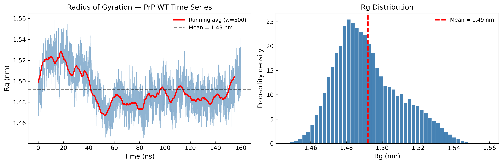

    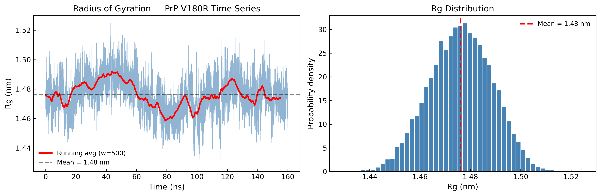

* **Conformational Sampling ($R_g$ vs. $R_{ee}$):** The correlation plot between the Radius of Gyration and the End-to-End distance shows a highly dense, centralized cluster for V180R. The WT data points are scattered across a much larger area of the conformational landscape, highlighting the inherent structural instability of the native sequence.

    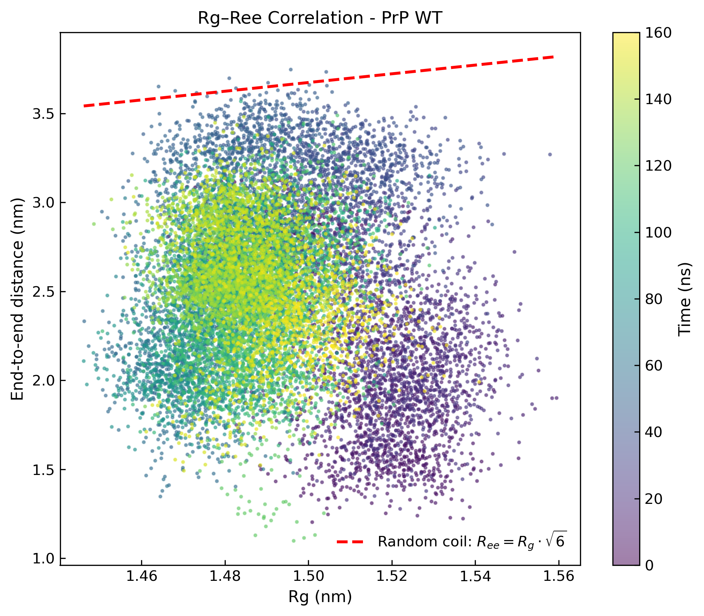
    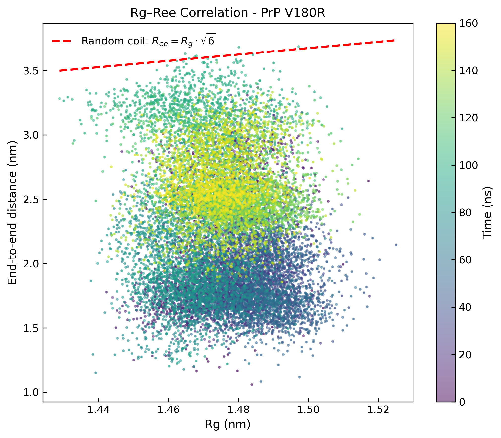

### 3. Local Flexibility and Resisting Structural Lamination (RMSF)
The per-residue RMSF profiles are globally comparable, with one critical, highly localized exception at position **Ser170**:
* In the WT simulation, Ser170 exhibits massive fluctuations reaching **3.0 Å**. In the V180R mutant, this flexibility is drastically suppressed to **1.2 Å**.
* Ser170 is situated immediately upstream of the Helix 2 entry site. Rigidifying this specific residue anchors the loop and prevents the structural unravelling of the downstream helix.

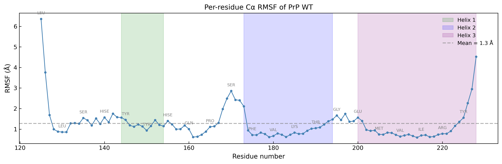

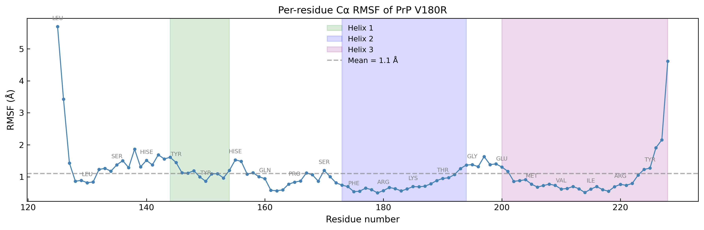

### 4. Secondary Structure Preservation (DSSP)
The evolution of secondary structure over time corroborates the stabilization observed in the macroscopic metrics:
* **Loop Anchoring:** The per-residue helical fraction for the loop segment immediately preceding Helix 2 (residues 165–170) is significantly higher in the mutant (**0.8**) than in the WT (**0.55**).

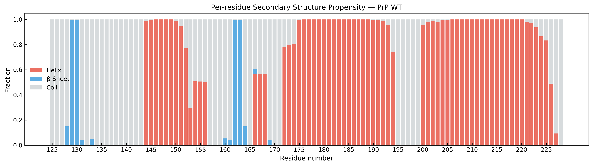

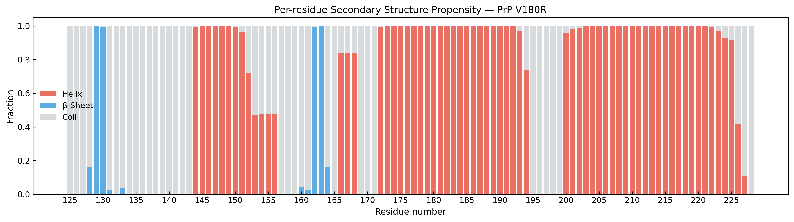
* **Global Helical Content:** The total α-helix fraction over time remains nearly horizontal for V180R with negligible fluctuations. In contrast, the WT exhibits high-amplitude oscillations ranging from **54% to 63%**, indicating an unstable, shifting secondary structure. The β-sheet fraction over time is also noticeably smoother and less volatile in the mutant system.

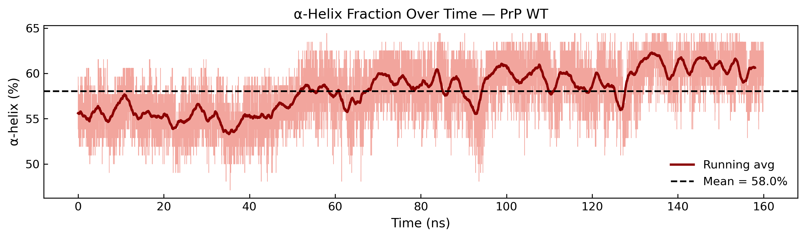

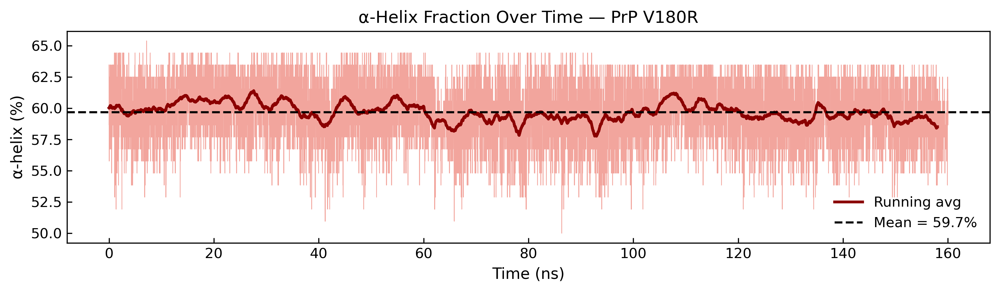

### 5. Hydrogen Bonding Networks and Tertiary Interfaces
* **Intramolecular Hydrogen Bonds:** The total number of internal hydrogen bonds follows a normal distribution in both systems, but the V180R mutant maintains a higher average network density (**44.6 bonds**) compared to the WT (**42.5 bonds**), providing a direct chemical explanation for its enhanced stability.

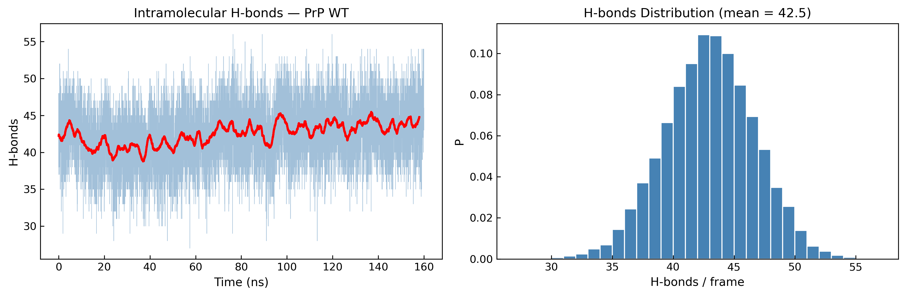

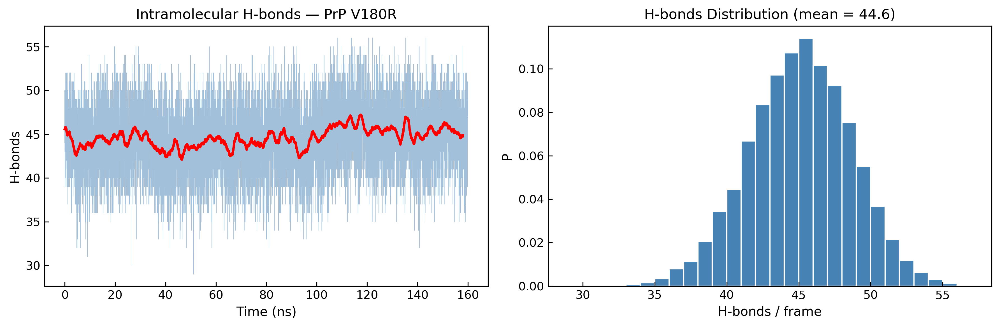
* **Helix 2 - Helix 3 Packing:** The average Cα-Cα distance matrix appears globally darker for the V180R system, reflecting shorter distances and tighter packing at the tertiary interface. Plotting Helix 2 $R_g$ against the minimum Helix 2 - Helix 3 distance shows a right-shifted population for the WT, which is a direct consequence of its transient global expansion and domain loosening.

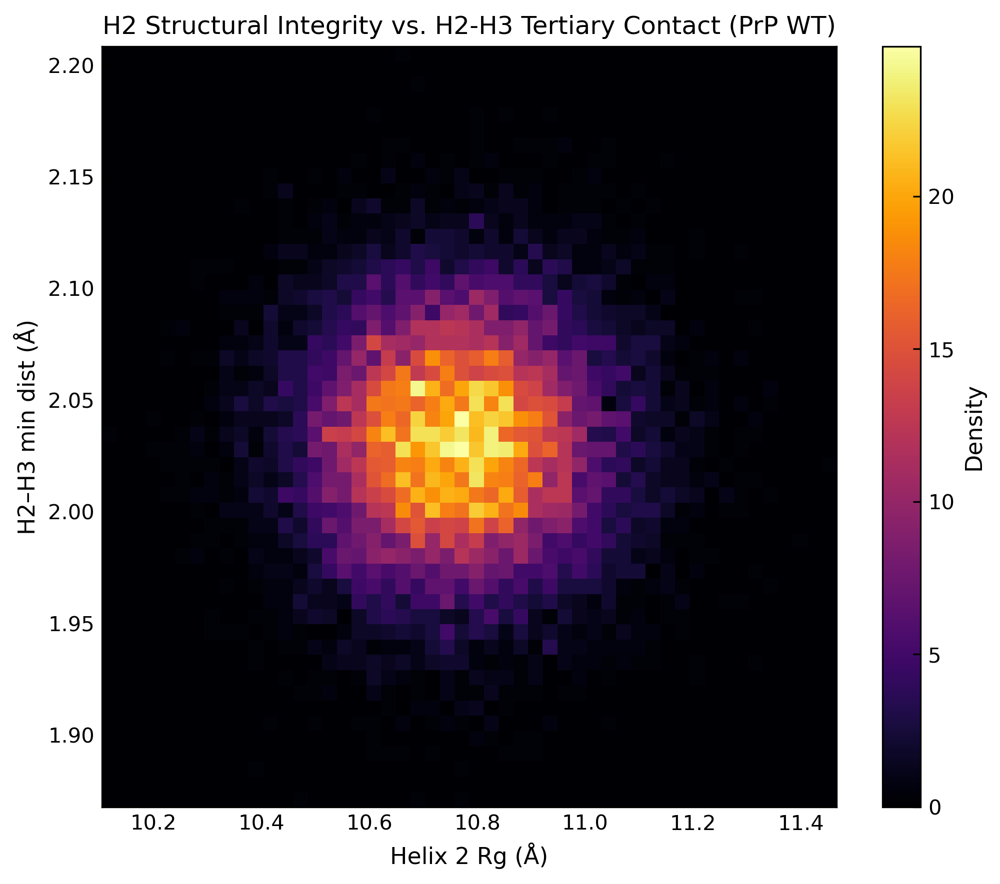

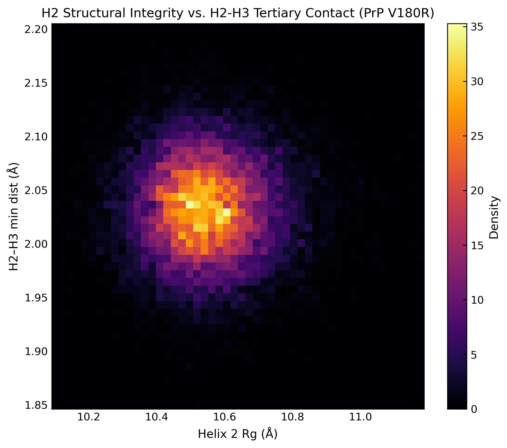

* **Disulfide Bridge & Torsional Angles:** The covalent staple distance (Cys179–Cys214 SG–SG) remains identically intact at ~2.05 Å for both systems, showing no anomalous strain. However, the **Ramachandran plots** for the target region show that the WT samples a highly scattered dihedral space - including the sterically strained upper-right quadrant (positive Φ and Ψ) - while the V180R mutant remains strictly constrained within the highly favorable native basins.

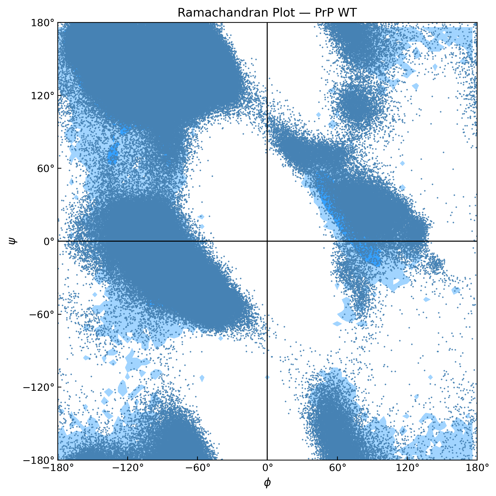

---

### Summary Table

| Mutation | Position | Region / Context | Consensus Z-Score | Global RMSD vs WT | Primary Structural Effect |
|---|---|---|-------------------|---|---|
| **V180R** | 180 | Helix 2 / Target Region (170-195) | -1.64             | **-0.8 Å** (Stabilization) | Rigidifies the Helix 2 loop entry, tightens H2-H3 packing, increases H-bonds, and suppresses conformational drift. |

Summing up, the V180R mutation makes the native structured prion domain more rigid, stable, and compact compared to the wild-type. The stabilization of the native alpha-helical form (PrP^C) represents the classic mechanism of action of strong "breakers," as it physically blocks the conformational transition of the protein into the pathological beta-sheet (PrP^Sc).
